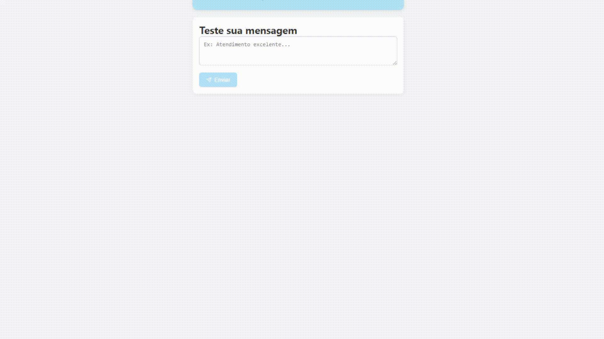

# Sentiment_analysis_system

Projeto completo de deploy de modelo de Machine Learning como microserviço com FastAPI, Docker e AWS EC2.  
Permite envio de mensagens de texto e retorno do sentimento com resposta simulada de IA generativa.

## Demonstração


## Tecnologias usadas
- Scikit-Learn
- FastAPI
- Docker
- AWS EC2 + SageMaker Studio
- ReactNative

## Funcionalidades
- Treinamento e exportação de modelo `.pkl`
- API REST documentada (Swagger)
- Deploy em ambiente cloud (EC2)
- Segurança via chave SSH e teardown de infraestrutura

## Como rodar
```bash
docker build -t sentiment-api .
docker run -d -p 80:80 sentiment-api

